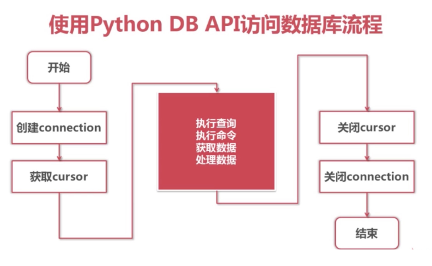

# Database Interaction 数据库交互

## Python DB API 访问

### 操作步骤




### 引入模块


```python
from pymysql import *
```


### 建立连接

#### 创建连接对象

调用connect()方法即可

```python
conn=connect(参数列表)
```

- 参数`host`：连接的mysql主机，如果本机是'localhost'
- 参数`port`：连接的mysql主机的端口，默认是3306
- 参数`database`：数据库的名称
- 参数`user`：连接的用户名
- 参数`password`：连接的密码
- 参数`charset`：通信采用的编码方式，推荐使用utf8


#### 连接对象的方法

- `close()`：关闭连接
- `commit()`：提交
- `cursor()`：返回Cursor对象，用于执行sql语句并获得结果


### 获取Cursor对象

获取Cursor对象：调用Connection对象的cursor()方法

```python
cs1=conn.cursor()
```

- 用于执行sql语句，使用频度最高的语句为select、insert、update、delete


#### Cursor对象的方法

- `close()`关闭
- `execute(operation [, parameters ])`执行语句，返回受影响的行数，主要用于执行insert、update、delete语句，也可以执行create、alter、drop等语句
- `fetchone()`执行查询语句时，获取查询结果集的第一个行数据，返回一个元组
- `fetchall()`执行查询时，获取结果集的所有行，一行构成一个元组，再将这些元组装入一个元组返回

#### Cursor对象的属性

- `rowcount`只读属性，表示最近一次execute()执行后受影响的行数
- `connection`获得当前连接对象


### 参数化语句

- SQL语句的参数化，可以有效防止sql注入
- 参数化不同于python的字符串格式化，**全部使用%s占位**


## 元类实现ORM

### 1. 元类

- [进阶提升](..\Python Basics\进阶提升\index.md)


### 1. ORM

概念：

- ORM 是 Python编程语言后端web框架 Django的核心思想，
- “Object Relational Mapping”，即对象-关系映射，简称ORM。

- 使用实例对象映射数据库表，类属性映射数据表字段。让数据库操作变得像操作对象属性一样简单：``class.property = data`


### 2. 通过元类简单实现ORM中的insert功能

```python
class ModelMetaclass(type):
	"""元类 ModelMetaclass"""

	def __new__(cls, name, bases, attrs):
		mappings = dict()

		# 判断是否需要保存
		for k, v in attrs.items():
			# 如果值是元组，那么保存在字典中。不去除重复地添加。
			if isinstance(v, tuple):
				print("Found Mapping: %s --> %s" % (k, v))
				mappings[k] = v

		# 删除已经在字典中存储的属性，即去重
		for k in mappings.keys():
			attrs.pop(k)

		# 将之前的关键字及其对象引用存储到其属性中
		attrs['__mappings__'] = mappings
		attrs['__table__'] = name

		return type.__new__(cls, name, bases, attrs)


class Module(metaclass=ModelMetaclass):
	"""基类"""
	def __init__(self, **kwargs):
		for name, value in kwargs.items():
			setattr(self, name, value)

	
	def save(self):
		fields = []
		args = []

		for k, v in self.__mappings__.items():
			fields.append(v[0])
			args.append(getattr(self, k, None))

		# 检测数字类型和字符串类型
		args_cmp = []
		for tmp in args:
			if isinstance(tmp, int):
				args_cmp.append(str(tmp))

			elif isinstance(tmp, str):
				args_cmp.append("""'%s'""" % tmp)

		sql = "insert into %s(%s) values (%s)" % (self.__table__, ','.join(fields), ','.join(args_cmp))

		print('SQL: %s' % sql)


class User(Module):
	uid = ('uid', "int unsigned")
	name = ('username', "varchar(30)")
	email = ('email', "varchar(30)")
	password = ('password', "varchar(30)")

	# 依照其元类进行类定制，那么其所有值均在 __mappings__ 的属性中
    # __mappings__ = {
    #     "uid": ('uid', "int unsigned")
    #     "name": ('username', "varchar(30)")
    #     "email": ('email', "varchar(30)")
    #     "password": ('password', "varchar(30)")
    # }
    # 同时，还有一个属性为 __table__ = "User"


user = User(uid = 123, name="Aaron", email="abackhand@orm.com", password="xx123xx")

user.save()
```

- 编写时，请始终记住自己的需求：SQL语句。
- 可首先编写到统一类，再抽取到基类。


