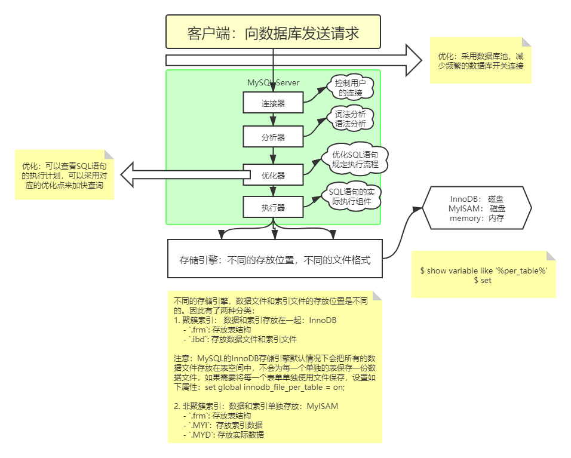

# MySQL Overview

## MySQL 简介

- [MySQL官方网站](http://www.MySQL.com)

## 安装与配置

### MySQL on Linux

- [Ubuntu MySQL 安装教程](Ubuntu MySQL 安装教程.md)
    - 服务端
    - 客户端，包括命令行客户端与图形化客户端Navicat
- [MySQL重置管理员密码](MySQL重置管理员密码.md)
- [Linux MySQL5.7 安装教程](Linux MySQL5.7 安装教程.md)

- [Linux MySQL5.7 彻底卸载](Linux MySQL5.7 彻底卸载.md)

### MySQL on Win

- [Win 10 MySQL5.7 安装教程](Win10 MySQL5.7 安装教程.md)
- 图形化界面客户端Navicat

## 基本操作

- [MySQL基础入门](MySQL基础入门.md)
- [MySQL练习题](MySQL练习题.md)

- [MySQL经典笔试题](MySQL经典笔试题.md)

## 高级特征

### 数据库视图

- [MySQL视图基础](MySQL视图基础.md)

### 数据库事务

- [MySQL事务基础](MySQL事务基础.md)

- [MySQL事务测试](MySQL事务测试.md)

### 数据库索引

- [MySQL索引基础](MySQL索引基础.md)
- 

### 账户管理

- [MySQL账户管理](MySQL账户管理.md)

### 主从复制和读写分离

安装配置

- [MySQL主从复制安装配置](MySQL主从复制安装配置.md)

主从复制原理

- [MySQL主从复制原理](MySQL主从复制原理.md)

读写分离

- [MySQL读写分离](MySQL读写分离.md)
- [使用amoeba实现MySQL读写分离](使用amoeba实现MySQL读写分离.md)

## MySQL 语句优化

### MySQL执行计划

[MySQL执行计划](MySQL执行计划.md)

### MySQL锁机制

[MySQL的锁机制](MySQL的锁机制.md)

## 基本架构及日志实现

## MySQL数据库外部连接

### Database Interaction with C

### Database Interaction with Java

- JDBC及代码分层

- 反射技术实现及封装

- DBUtil及数据库连接池（dbcp、c3p0）

- 数据库连接池（druid、hikariCP）

### Database Interaction with Python

- [Database Interaction](https://wiki.abookworm.site/250 Working Coding Python/Database Interaction/)

## 其他

### 1. [廖雪峰的 MySQL 教程笔记](MySQL from liaoxuefeng.com.md)