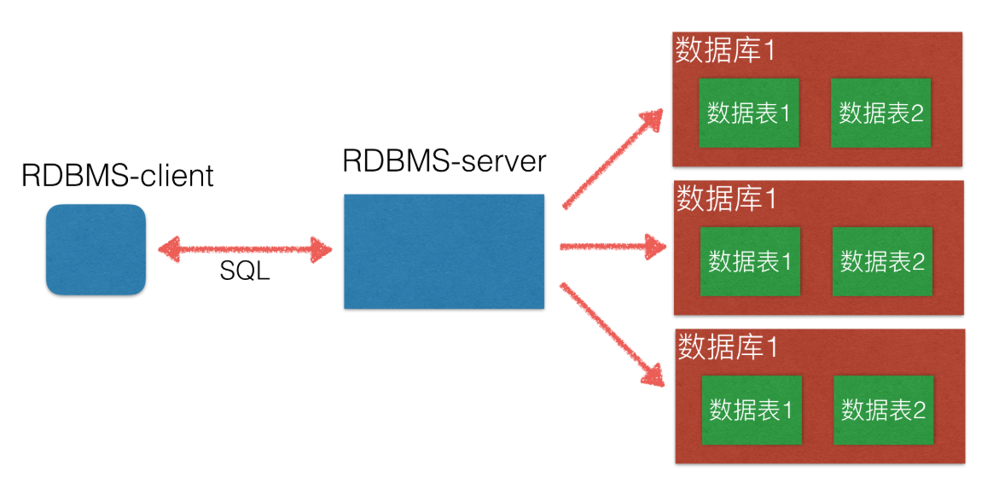

# 数据库操作与配置

## 一、数据库简介

### 数据存储

1. 文件
2. 数据库

### 数据库发展

- 数据持久化，磁盘化

- IT or DT

## 二、数据库分类

### 关系型数据库SQL

#### 1. [MySQL](./MySQL/index.md)

- 目前应用最为广泛的关系型数据库

#### 2. [Oracle](./Oracle/index.md)

- 前公司使用的数据库系统
- 以前的大型项目中使用,银行,电信等项目

#### 3. SQL server

- 主要用于 `.Net`编程。
- 微软项目

#### 4. DB2

- 常用于：金融 & 银行

#### 5. SQLite

- 轻量级数据库，主要应用在移动平台

### 非关系型数据库NoSQL

#### 1. Hbase

#### 2. [Redis](./Redis/index.md)

#### 3. [MongoDB](./MongoDB/index.md)

## 关系型数据库

### RDBMS

> 全称：Relational Database Management System

#### 概念

建立在关系模型基础上的数据库，借助于集合代数等数学概念和方法来处理数据库中的数据

### RDBMS和数据库的关系

### SQL

> 全称：Structured Query Language

#### 特点

- 结构化查询语言，是一种用来操作RDBMS的数据库语言

- 不区分大小写

#### 分类

- **DQL：数据查询语言，用于对数据进行查询，如select**
- **DML：数据操作语言，对数据进行增加、修改、删除，如insert、udpate、delete**
- TPL：事务处理语言，对事务进行处理，包括begin transaction、commit、rollback
- DCL：数据控制语言，进行授权与权限回收，如grant、revoke
- **DDL：数据定义语言，进行数据库、表的管理等，如create、drop**
- CCL：指针控制语言，通过控制指针完成表的操作，如declare cursor

#### 关系型数据库核心元素

- 数据行(记录)
- 数据列(字段)
- 数据表(数据行的集合)
- 数据库(数据表的集合)

