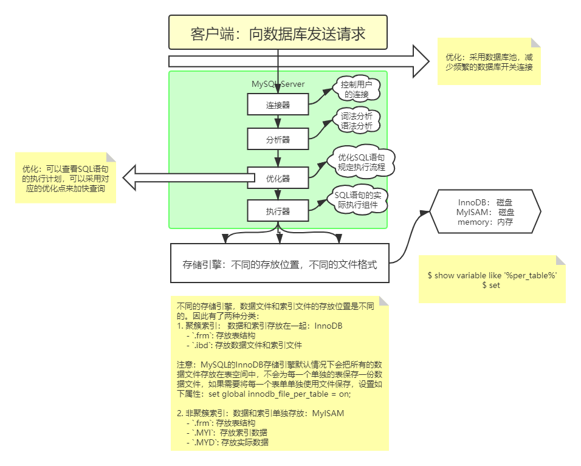

# MySQL Overview

## MySQL 简介

- [MySQL官方网站](http://www.MySQL.com)

## 安装与配置

### MySQL on Linux

- [Ubuntu MySQL 安装教程](Ubuntu MySQL 安装教程.md)
    - 服务端
    - 客户端，包括命令行客户端与图形化客户端Navicat
- [Linux MySQL5.7 安装教程](Linux MySQL5.7 安装教程.md)

- [Linux MySQL5.7 彻底卸载](Linux MySQL5.7 彻底卸载.md)

### MySQL on Win

- [MySQL5.7 installation guide on Win10](MySQL5.7 installation guide on Win10.md)
- 图形化界面客户端Navicat

## 基本操作

- [MySQL基础入门](MySQL 基础入门.md)

- [MySQL练习题](MySQL练习题.md)

## 高级特征

### 数据库视图

- [MySQL视图基础](MySQL视图基础.md)

### 数据库事务

- [MySQL事务基础](MySQL事务基础.md)

- [MySQL事务测试](MySQL事务测试.md)

### 数据库索引

- [MySQL索引基础](MySQL索引基础.md)

### 账户管理

- [MySQL账户管理](MySQL账户管理.md)

### 主从复制和读写分离

安装配置

- [MySQL主从复制安装配置.md](MySQL主从复制安装配置.md)

主从复制原理

- [MySQL主从复制原理.md](MySQL主从复制原理.md)

读写分离

- [MySQL读写分离.md](MySQL读写分离.md)
- [使用amoeba实现MySQL读写分离.md](使用amoeba实现MySQL读写分离.md)

## MySQL 语句优化

### MySQL执行计划

[MySQL执行计划.md](MySQL执行计划.md)

### MySQL锁机制

[MySQL的锁机制.md](MySQL的锁机制.md)

## 基本架构及日志实现

## MySQL数据库外部连接

- Database Interaction with C

- Database Interaction with Java

    - JDBC及代码分层

    - 反射技术实现及封装

    - DBUtil及数据库连接池（dbcp、c3p0）

    - 数据库连接池（druid、hikariCP）

        

- Database Interaction with Python

  